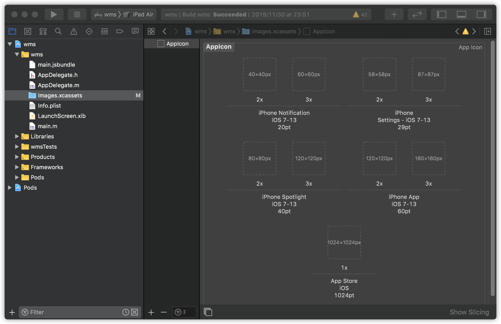
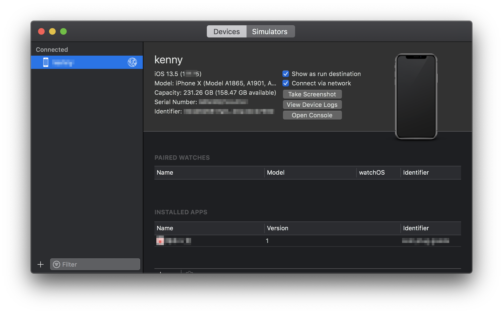
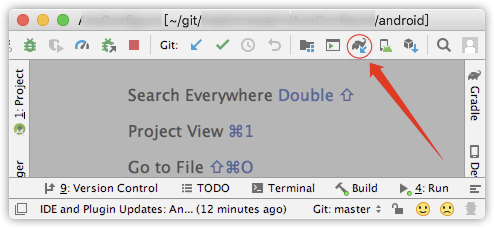
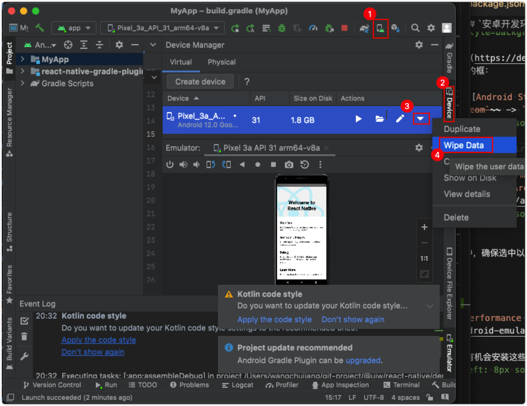
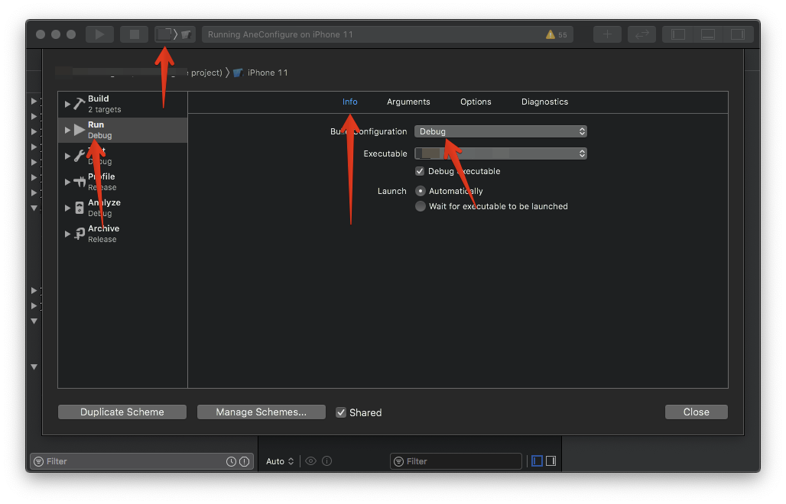
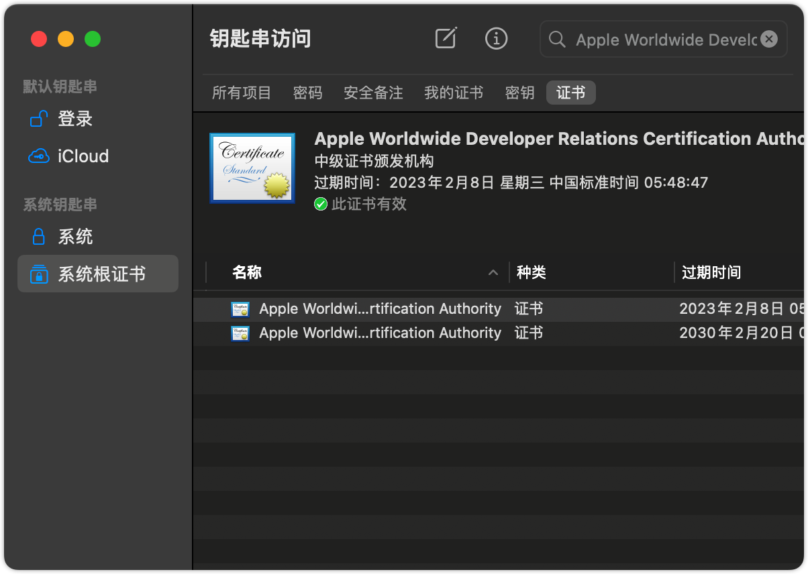

<div align="left">
  <sup>使用<a href="https://wangchujiang.com/#/app" target="_blank">我的应用</a>，也是对我的<a href="https://wangchujiang.com/#/sponsor" target="_blank">支持</a>：</sup>
  <br>
  <a target="_blank" href="https://apps.apple.com/app/6758053530" title="Scap: Screenshot & Markup Edit for macOS"></a>
  <a target="_blank" href="https://apps.apple.com/app/6757317079" title="Screen Test for macOS"></a>
  <a target="_blank" href="https://apps.apple.com/app/Deskmark/6755948110" title="Deskmark for macOS"></a>
  <a target="_blank" href="https://apps.apple.com/app/Keyzer/6500434773" title="Keyzer for macOS"></a>
  <a target="_blank" href="https://github.com/jaywcjlove/vidwall-hub" title="Vidwall Hub for macOS"></a>
  <a target="_blank" href="https://apps.apple.com/app/VidCrop/6752624705" title="VidCrop for macOS"></a>
  <a target="_blank" href="https://apps.apple.com/app/Vidwall/6747587746" title="Vidwall for macOS"></a>
  <a target="_blank" href="https://wangchujiang.com/mousio-hint/" title="Mousio Hint for macOS"></a>
  <a target="_blank" href="https://apps.apple.com/app/6746747327" title="Mousio for macOS"></a>
  <a target="_blank" href="https://apps.apple.com/app/6745227444" title="Musicer for macOS"></a>
  <a target="_blank" href="https://apps.apple.com/app/6743841447" title="Audioer for macOS"></a>
  <a target="_blank" href="https://apps.apple.com/app/6744690194" title="FileSentinel for macOS"></a>
  <a target="_blank" href="https://apps.apple.com/app/6743495172" title="FocusCursor for macOS"></a>
  <a target="_blank" href="https://apps.apple.com/app/6742680573" title="Videoer for macOS"></a>
  <a target="_blank" href="https://apps.apple.com/app/6740425504" title="KeyClicker for macOS"></a>
  <a target="_blank" href="https://apps.apple.com/app/6739052447" title="DayBar for macOS"></a>
  <a target="_blank" href="https://apps.apple.com/app/6739444407" title="Iconed for macOS"></a>
  <a target="_blank" href="https://apps.apple.com/app/6737160756" title="Menuist for macOS"></a>
  <a target="_blank" href="https://apps.apple.com/app/6723903021" title="Paste Quick for macOS"></a>
  <a target="_blank" href="https://apps.apple.com/app/6670696072?platform=mac" title="Quick RSS for macOS/iOS"></a>
  <a target="_blank" href="https://apps.apple.com/app/6670167443" title="Web Serve for macOS"></a>
  <a target="_blank" href="https://apps.apple.com/app/6503953628?platform=mac" title="Copybook Generator for macOS/iOS"></a>
  <a target="_blank" href="https://apps.apple.com/app/6471227008?platform=mac" title="DevTutor for macOS/iOS"></a>
  <a target="_blank" href="https://apps.apple.com/app/6479819388?platform=mac" title="RegexMate for macOS/iOS"></a>
  <a target="_blank" href="https://apps.apple.com/app/6479194014?platform=mac" title="Time Passage for macOS/iOS"></a>
  <a target="_blank" href="https://apps.apple.com/app/6478772538" title="IconizeFolder for macOS"></a>
  <a target="_blank" href="https://apps.apple.com/app/6478511402?platform=mac" title="Textsound Saver for macOS/iOS"></a>
  <a target="_blank" href="https://apps.apple.com/app/6476924627" title="Create Custom Symbols for macOS"></a>
  <a target="_blank" href="https://apps.apple.com/app/6476452351" title="DevHub for macOS"></a>
  <a target="_blank" href="https://apps.apple.com/app/6476400184" title="Resume Revise for macOS"></a>
  <a target="_blank" href="https://apps.apple.com/app/6472593276" title="Palette Genius for macOS"></a>
  <a target="_blank" href="https://apps.apple.com/app/6470879005" title="Symbol Scribe for macOS"></a>
</div>
<hr>

<!--idoc:ignore:start-->
React Native
===


[](https://jaywcjlove.github.io/#/sponsor)
[](https://x.com/jaywcjlove)

<!--idoc:ignore:end-->

一些 React Native 开发上遇到的问题简单记录。

<!--idoc:ignore:start-->

## 目录

- [修改 App 在手机上展示的名称](#修改-app-在手机上展示的名称)
- [修改 App 在手机上展示的图标](#修改-app-在手机上展示的图标)
- [判断 Release/Debug 用于调试](#判断-releasedebug-用于调试)
- [开发模式弹出开发者菜单刷新应用](#开发模式弹出开发者菜单刷新应用)
- [设置允许 HTTP 请求访问](#设置允许-http-请求访问)
- [真机配置 IP 调试](#真机配置-ip-调试)
- [Xcode 不用数据线真机调试](#xcode-不用数据线真机调试)
- [打包修改 APP 版本号](#打包修改-app-版本号)
- [常见错误](#常见错误)
  - [应用反应缓慢出现卡顿问题](#应用反应缓慢出现卡顿问题)
  - [Android: Gradle project sync failed](#android-gradle-project-sync-failed)
  - [Android: The device needs more free storage to install the application](#android-the-device-needs-more-free-storage-to-install-the-application)
  - [Android: Cannot convert string value 'UNIFIED_TEST_PLATFORM'](#android-cannot-convert-string-value-unified_test_platform)
  - [iOS: library not found for -lDoubleConversion](#ios-library-not-found-for--ldoubleconversion)
  - [iOS: symbol(s) not found for architecture i386](#ios-symbols-not-found-for-architecture-i386)
  - [iOS: Command PhaseScriptExecution failed with a nonzero exit code](#ios-command-phasescriptexecution-failed-with-a-nonzero-exit-code)

<!--idoc:ignore:end-->

## 修改 App 在手机上展示的名称

#### Android

修改 `android/app/src/main/res/values/strings.xml` 配置

```xml
<resources>
  <string name="app_name">这里填写名称</string>
</resources>
```

#### iOS

修改 `ios/<应用名称>/Info.plist` 配置

```xml
<key>CFBundleDisplayName</key>
<string>这里填写名称</string>
```

## 修改 App 在手机上展示的图标

#### Android

修改替换 `android/app/src/main/res/mipmap-(*)` 下面的图标

图标分为 方形图标(`ic_launcher.png`) 和 圆形图标(`ic_launcher_round.png`)

#### iOS

修改 `ios/<应用名称>/Images.xcassets/AppIcon.appiconset/Contents.json` 配置，及修改配置目录 `ios/<应用名称>/Images.xcassets/AppIcon.appiconset` 下的图标文件。

通过 xcode 下图拖拽更换图标更方便。



## 判断 Release/Debug 用于调试

#### Android

修改 `android/app/src/main/res/values/strings.xml` 配置

```java
// 在Android Studio项目中
if(BuildConfig.DEBUG){
  // debug模式
}else{
  // release模式
}
```

#### iOS

```objective-c
#ifdef DEBUG
   // debug模式
#else
    //release 模式
#endif
```

#### React Native

```js
if (__DEV__) {
  // debug 模式
} else {
  // release 模式
}
```

## 开发模式弹出开发者菜单刷新应用

命令行支持*打开开发者菜单*，和其它的一些操作

- r - 重新加载应用
- d - 打开开发者菜单
- i - 在 iOS 上运行
- a - 在 Android 上运行


#### Android

按两次 <kbd>R</kbd> 键或从开发者菜单(<kbd>⌘</kbd><kbd>M</kbd>)中选择重新加载(Reload)以预览您的更改。

> 如果没有起作用可以在命令行使用 `adb shell input keyevent 82` 命令唤起**开发者菜单**

#### iOS

使用 <kbd>⌘</kbd><kbd>R</kbd> 让您的 IOS 模拟器重新加载本地项目，使用 <kbd>⌘</kbd><kbd>T</kbd> 弹出开发者菜单。

## 设置允许 HTTP 请求访问

#### Android

创建配置文件 `android/app/src/main/res/xml/network_security_config.xml` 内容如下：

```xml
<?xml version="1.0" encoding="utf-8"?>
<network-security-config>
    <base-config cleartextTrafficPermitted="true" />
</network-security-config>
```

修改配置 `android/app/src/main/AndroidManifest.xml`

```diff
<application
  android:name=".MainApplication"
  android:label="@string/app_name"
  android:icon="@mipmap/ic_launcher"
  android:roundIcon="@mipmap/ic_launcher_round"
  android:allowBackup="false"
+  android:networkSecurityConfig="@xml/network_security_config"
  android:theme="@style/AppTheme">
</application>
```

#### iOS

修改 `ios/<应用名称>/Info.plist` 配置

```xml
<key>NSAppTransportSecurity</key>
<dict>
  <key>NSAllowsArbitraryLoads</key>
  <true/>
</dict>
```

## 真机配置 IP 调试

#### 配置说明

1. ⚠️ 首先保证真机和 pc 在同一个局域网络下。
2. 摇晃你的实体真机，调出配置弹窗。
3. 团队开发可以不安装开发环境。

**`摇晃手机`** => `Configure Bundler` => 设置 `ip:端口`

默认端口：`8081` 可以通过参数更改默认端口 `react-native start --port 9999`

#### Android 设置


#### iOS 设置

设置 `Build Configuration` 为 `Debug` 模式连接真机打包 APP。  

> `Xcode` => `Product` => `Scheme` => `Edit Scheme...` => `Run` => `Info` => `Build Configuration` => `Debug`

## Xcode 不用数据线真机调试

通过菜单 `Xcode` => `Product` => `Destination` => `Add Additional Simulators...` 打开设置界面，勾选 `Connect via network`。



如果是第一次操作， 可能会需要先进行配对操作；

1. 可在以上面弹出的界面中，点击左侧的设备，然后右健选`unpair device`。
2. 然后再去勾选 `connect via network`；
3. 这时手机上会提示信任界面，点击确认即可。

## 打包修改 APP 版本号

#### Android

修改 `android/app/build.gradle` 配置

```java
android {
  .....
  defaultConfig {
    ....
    versionName "2.1.1"
  }
}
```

#### iOS

修改 `ios/<应用名称>/Info.plist` 配置

```xml
<key>CFBundleShortVersionString</key>
<string>1.2.0</string>
```

## 常见错误

### 应用反应缓慢，出现卡顿问题

#### 可能存在的问题

- 查看是否 console 日志打印过度造成。
- React Native Debugger 页面放到最前面，浏览器窗口不要放到选项卡里面。

### Android: Gradle project sync failed.

#### 问题解决方法

在 Android Gradle 同步失败，导致项目无法启动，只需重新同步 Gradle 即可(可能需要翻墙)，方法如下图。



### Android: The device needs more free storage to install the application

#### 问题解决方法



### Android: Cannot convert string value 'UNIFIED_TEST_PLATFORM'

```bash
convert string value 'UNIFIED_TEST_PLATFORM' to an enum value of type 'com.android.builder.model.AndroidGradlePluginProjectFlags$BooleanFlag' (valid case insensitive values: APPLICATION_R_CLASS_CONSTANT_IDS, TEST_R_CLASS_CONSTANT_IDS, TRANSITIVE_R_CLASS, JETPACK_COMPOSE, ML_MODEL_BINDING)
```

#### 问题解决方法

你需要下载最新版 [`android-studio-2021.2.1.16-mac_arm.dmg`](https://developer.android.google.cn/studio/archive) 。

### iOS: library not found for -lDoubleConversion.

#### 问题解决方法

Xcode 打开工程文件错误，使用 `*.xcodeproj` 打开工程会报这个错误。

> 请打开 `*.xcworkspace` 的工程文件，错误将得到解决。

### iOS: symbol(s) not found for architecture i386.

#### 问题解决方法

可能使用的某个包，不支持 i386 模拟器，使用 x86 模拟器或真机。

> 设置 `Build Configuration` 为 `Debug` 模式下可能会解决问题。  
> `Xcode` => `Product` => `Scheme` => `Edit Scheme...` => `Run` => `Info` => `Build Configuration`  



### iOS: Command PhaseScriptExecution failed with a nonzero exit code

> React-Core-AccessibilityResources Command CodeSign failed with a nonzero exit code

#### 问题解决方法

打开 `Kaychain Access(钥匙串访问)` 应用删除 `Apple Worldwide Developer Relations Certification Authority` 证书



## Contributors

As always, thanks to our amazing contributors!

<a href="https://github.com/jaywcjlove/react-native/graphs/contributors">
  
</a>

Made with [action-contributors](https://github.com/jaywcjlove/github-action-contributors).

## License

Licensed under the MIT License.
